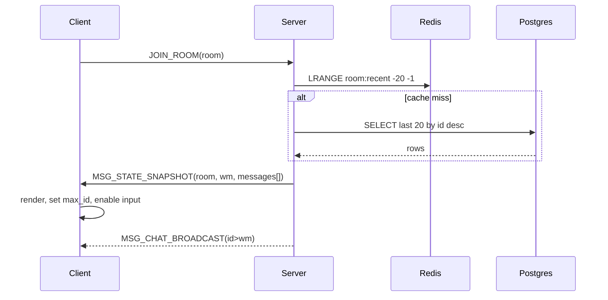

# Sequence: Join → Snapshot → Fanout

목표: 방 입장 시퀀스에서 스냅샷 로딩과 팬아웃 수신의 순서를 명확히 한다.

## 텍스트 시퀀스
1) Client → Server: `JOIN_ROOM(room_id)` (server/src/chat/handlers_join.cpp:21)
2) Server:
   - Redis `LRANGE room:{room_id}:recent -20 -1` (TODO)
   - 누락 시 Postgres 보강 쿼리 (server/src/chat/chat_service_core.cpp:282)
   - `wm = current_max_message_id(room)` (server/src/chat/chat_service_core.cpp:262)
3) Server → Client: `MSG_STATE_SNAPSHOT{room_id, wm, messages[asc]}` 또는 BEGIN/END 프로토콜 (server/src/chat/chat_service_core.cpp:213)
4) Client: (TODO)
   - 메시지 렌더링, `max_id = max(messages.id)` (TODO)
   - `snapshot_complete` 처리 후 입력창 활성화 (TODO)
5) Server ↔ Client: 이후 브로드캐스트 `MSG_CHAT_BROADCAST{id, ...}` (server/src/chat/handlers_chat.cpp:214)
   - Client는 `id <= max(wm, max_id)` 무시 (TODO)

## 장애 분기
- Redis 장애: 2)에서 바로 Postgres로 쿼리 후 3) 진행. 캐시는 이후 배경에서 재구축 (TODO)
- Postgres 장애: 에러로 종료(복구/재시도 안내). 캐시만으로는 정합 보장 불가 (TODO)

## 메르메이드(참고용)

