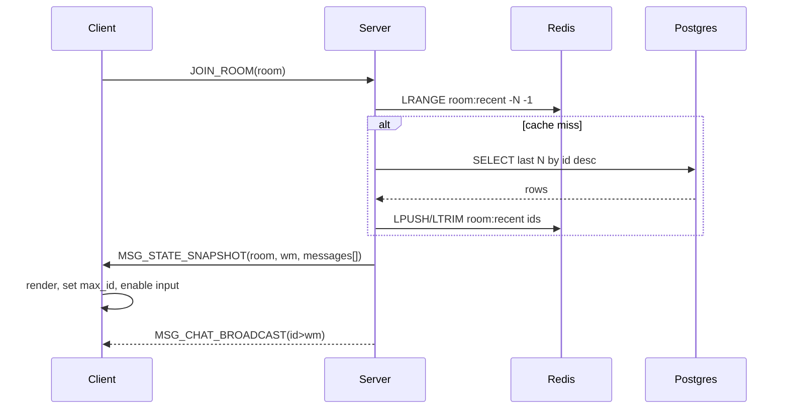

# Sequence: Join → Snapshot → Fanout

목표: 룸 입장 과정에서 스냅샷을 먼저 적용하고, 이어지는 브로드캐스트 스트림과 자연스럽게 이어 붙여 중복/누락 없이 최신 상태를 제공한다.

## 단계별 흐름
1. **Client → Server**: `JOIN_ROOM(room_id)` 요청 전송. (server/src/chat/handlers_join.cpp:21)
2. **Server (Snapshot 준비)**:
   - Redis `LRANGE room:{room_id}:recent -RECENT_HISTORY_LIMIT -1`로 최신 message_id 리스트 조회.
   - 캐시 miss 시 Postgres에서 `SELECT ... ORDER BY id DESC LIMIT N`으로 보충하고 Redis에 write-back.
   - `wm = current_max_message_id(room)`을 계산해 워터마크로 사용. (server/src/chat/chat_service_core.cpp:262)
3. **Server → Client**: `MSG_STATE_SNAPSHOT{ room_id, wm, messages[asc] }` 전송 또는 BEGIN/END 프레이밍. (server/src/chat/chat_service_core.cpp:213)
4. **Client 처리**:
   - 메시지를 렌더링하고 `max_id = max(messages.id)`로 업데이트.
   - `snapshot_complete` 이벤트를 받은 뒤 입력창/전송 버튼을 활성화한다.
5. **Server → Client (Fanout)**: 이후 브로드캐스트 `MSG_CHAT_BROADCAST{id,...}`를 그대로 전달. 클라이언트는 `id <= max(wm, max_id)`인 메시지를 버린다. (server/src/chat/handlers_chat.cpp:214)

## Redis / Postgres 폴백
- Redis 장애 시 바로 Postgres에서 스냅샷을 구성한 뒤 Redis LIST/JSON을 재구축한다.
- Postgres 장애 시 캐시에 남아 있는 메시지만 전송하고 브로드캐스트로 덮어쓰며, UI에는 “최근 기록 제한” 배지를 표시한다.

## 시퀀스 다이어그램

