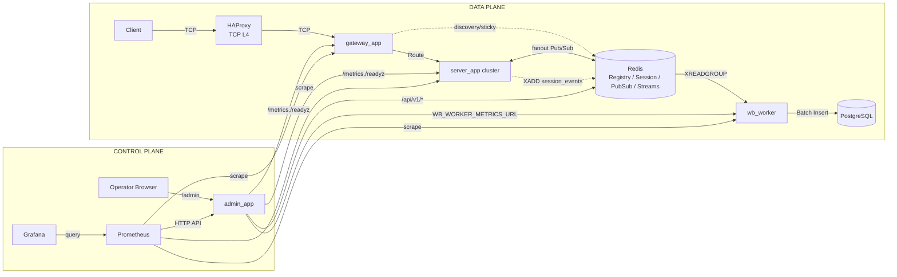
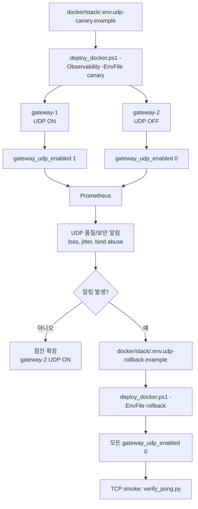

# 운영 아키텍처 다이어그램 (상세)

README의 다이어그램은 개요 전달을 위한 최소 표현이다.
이 문서는 운영/장애 대응에서 자주 보는 제어면(control plane), 관측면(observability), UDP 카나리 전환 흐름을 상세히 보여준다.

## 1) 런타임 + 제어면(운영)

핵심 의도:
- 데이터면(게임 트래픽)과 제어면(운영 API/UI)을 분리해 장애 대응 시 영향 반경을 줄인다.
- `admin_app`은 운영자 단일 진입점이며, Redis/서비스 메트릭/Prometheus를 집계한다.

## 2) UDP 카나리 전환/롤백

관련 문서:
- `docs/ops/udp-rollout-rollback.md`
- `docs/ops/observability.md`
- `docs/ops/admin-console.md`
