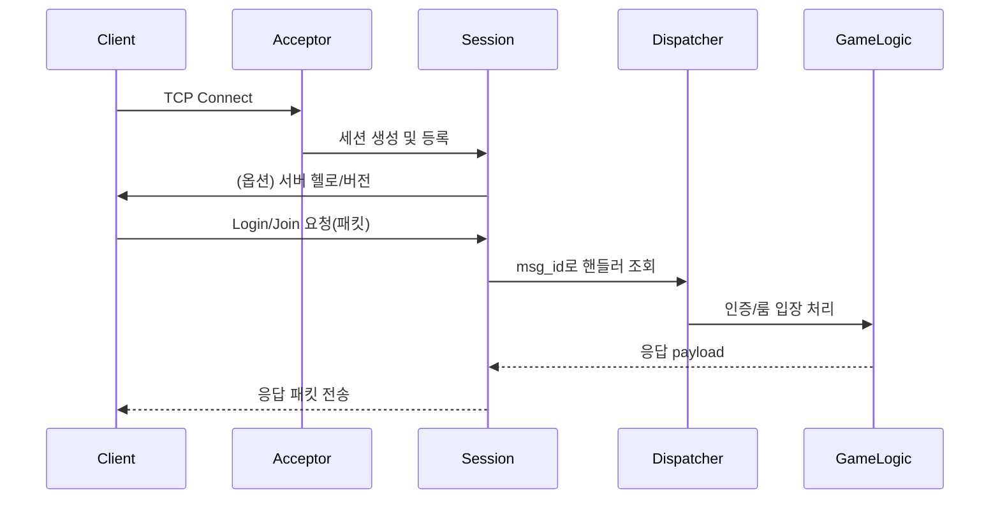

# IOCP/TCP 기반 게임 서버 아키텍처 기획서

## 1. 개요
- 목적: C++20과 Boost.Asio(IOCP 기반)를 사용하여 확장 가능하고 안정적인 실시간 게임 서버를 설계/구현한다.
- 목표 플랫폼: Windows 우선(내부적으로 IOCP), 리눅스도 epoll/kqueue로 빌드 가능(Boost.Asio 추상화 활용).
- 빌드 시스템: CMake
- 리포 구성 목표: 다음 4개 프로젝트로 나눈다. 주의: 특정 브랜드명이나 임시 레포명(예: Knights)을 코드/설정/타깃명에 사용하지 않는다.
  1) 서버 주요 기능을 담당하는 `server_core` 라이브러리(코어 프로젝트)
  2) 실제 운영용 `server_app` 실행 파일(프로덕션 서버 프로젝트)
  3) 개발·기능 검증용 `dev_chat_cli`(CLI 기반 채팅 클라이언트)
  4) 시뮬레이션/부하/통합 검증용 `server_tests`(실제 테스트 프로젝트)

## 2. 전체 아키텍처(모놀리식 → MSA)
```mermaid
flowchart LR
    subgraph Client Side
      CLI[DevClient/게임 클라이언트]
    end

    subgraph Edge/Gateway
      GW[Gateway Service\n(TCP Ingress, Session, Framing)]
      GWIO[io_context Threads]
      GW <--> GWIO
    end

    subgraph Core Services
      AUTH[Auth Service]
      CHAT[Chat Service]
      MATCH[Match Service]
      PRES[Presence Service]
      WORLD[World/Zone Service]
    end

    BUS[(Message Bus/Events)]:::bus
    RPC[[gRPC/HTTP2]]:::rpc
    OBS[Logging/Monitoring]:::aux
    CFG[Config/Discovery]:::aux

    CLI <-- TCP --> GW
    GW --> RPC --> AUTH
    GW --> RPC --> CHAT
    GW --> RPC --> MATCH
    GW --> RPC --> WORLD
    AUTH <-- BUS --> CHAT
    MATCH <-- BUS --> WORLD
    PRES <-- BUS --> CHAT
    OBS -.-> GW
    OBS -.-> AUTH
    OBS -.-> CHAT
    CFG -.-> GW
    CFG -.-> Core Services

    classDef aux fill:#eef,stroke:#99f,stroke-width:1px
    classDef bus fill:#efe,stroke:#5a5,stroke-width:1px
    classDef rpc fill:#ffe,stroke:#aa5,stroke-width:1px
```

- 경로: Client는 TCP로 Gateway에 접속 → Gateway가 세션/프레이밍/기본 정책을 담당 → 내부 RPC/gRPC로 각 마이크로서비스에 요청 전달 → 서비스 간 이벤트는 메시지 버스(BUS)로 비동기 전달.
- 비동기 I/O: 각 서비스는 Boost.Asio `io_context` 기반. Gateway는 고성능 TCP/세션에 집중, 도메인 로직은 서비스로 분리.
- 스케일링: 서비스별 독립 배포/스케일아웃(HPA). Gateway 다중 인스턴스 + L4/L7 로드밸런서. 상태는 서비스별 저장소로 분산.

## 3. 프로젝트 구성(리포 구조)
```
<repo-root>/
├─ CMakeLists.txt                 # 최상위: 옵션/공통 설정/서브디렉터리 추가
├─ cmake/                         # 툴체인/모듈/FindXXX.cmake
├─ docs/
│  └─ server-architecture.md
├─ core/                          # 코어 라이브러리(server_core)
│  ├─ include/server/core/...
│  ├─ src/...
│  └─ CMakeLists.txt              # target: server_core (STATIC/SHARED)
├─ services/
│  ├─ gateway/                    # Gateway Service (TCP ingress)
│  │  └─ CMakeLists.txt           # target: gateway_service + link server_core
│  ├─ auth/                       # 인증 서비스
│  │  └─ CMakeLists.txt           # target: auth_service
│  ├─ chat/                       # 채팅 서비스
│  │  └─ CMakeLists.txt           # target: chat_service
│  ├─ match/                      # 매치메이킹 서비스
│  │  └─ CMakeLists.txt           # target: match_service
│  └─ world/                      # 월드/존 서비스
│     └─ CMakeLists.txt           # target: world_service
├─ devclient/                     # 개발/디버그용 CLI 클라이언트(dev_chat_cli)
│  ├─ src/main.cpp
│  └─ CMakeLists.txt              # target: dev_chat_cli (EXE) + link server_core
└─ tests/                         # 통합/부하/프로토콜 테스트(server_tests)
   ├─ src/...
   └─ CMakeLists.txt              # target: server_tests (EXE) + link server_core
```

- 빌드 옵션 예: `KNIGHTS_ENABLE_TLS`, `KNIGHTS_ENABLE_PROFILING`, `KNIGHTS_MAX_CONNECTIONS`, `KNIGHTS_USE_PROTOBUF` 등.
- 프로토콜 헤더: v1.1 고정 14바이트(SEQ/UTC 포함). SEQ/UTC는 항상 포함되며 캡 능협상 불필요.
- 외부 의존: Boost(ASIO, System), spdlog(로그), fmt(포맷), GoogleTest(테스트), gRPC/Protobuf(내부 RPC), 메시지 브로커(NATS/Kafka/Redis Streams) 등 선택.
  - IDL 위치: `proto/` 디렉터리, gRPC 코드는 각 서비스에서 코드젠.

## 4. 네트워킹 설계
### 4.1 IO 모델
- Windows: Boost.Asio가 내부적으로 IOCP를 사용. `io_context` N개 스레드 풀에서 `async_*` 콜백 실행.
- 공평성: CPU 코어 수 기준 N=core_count 또는 N=core_count*2. Accept는 별도 `strand`.

### 4.2 연결 수락(Acceptor/Gateway)
- `Acceptor`는 리스닝 소켓을 관리, `async_accept` 루프로 신규 연결 처리. (core/src/net/acceptor.cpp:60)
- 연결 제한: 동시 세션 수 상한, 초과 시 즉시 거절.
- 보안: 화이트리스트/블랙리스트, 레이트 제한(초당 accept 제한), SYN flood 방어(커널 파라미터/방화벽 병행), mTLS(내부), JWT 토큰 검증(게이트웨이/인증 서비스 연계).

### 4.3 세션(Session) (core/src/net/session.cpp:48)
- 책임: 소켓 소유, 수신/송신 버퍼, 파싱/프레이밍, 사용자 컨텍스트, 타임아웃.
- 수신: length-prefixed 프레이밍을 위한 고정 헤더(예: 2~4바이트 길이 + 2바이트 메시지 ID + 옵션)를 먼저 읽고, 본문을 이어서 읽는다.
- 송신: 멀티 쓰레드 안전 큐 + `async_write` 체인. 백프레셔(큐 길이 상한) 초과 시 세션 종료.
- 타임아웃: 읽기/쓰기 타이머, keep-alive/heartbeat(예: 10초) 미수신 시 종료.
- 암호화(옵션): TLS(Asio SSL) 또는 경량 XOR/ChaCha20(개발용). 운영은 TLS 권장.

### 4.4 프로토콜(바이너리)
- Endianness: 네트워크 바이트 오더(big-endian) 권장.
- 헤더(v1.1, 14바이트 고정): `u16 length | u16 msg_id | u16 flags | u32 seq | u32 utc_ts_ms32`.
- 본문: 메시지별 스키마. 문자열은 UTF-8 + u16 길이 프리픽스.
- 압축/암호화: `flags`로 표시. 운영은 TLS 권장.

### 4.5 라우팅/디스패치
- Gateway 레벨 디스패치: `msg_id -> route(service, rpc)` 매핑. 인증 전/후 경로 분리.
- 서비스 레벨 디스패치: 각 서비스 내부 `Dispatcher`로 핸들러 등록. (core/src/net/dispatcher.cpp:12)
- 실행 모델: 세션별 직렬화(strand) + 서비스별 executor. 서비스 간 호출은 gRPC, 브로드캐스트/존 상태는 BUS 이벤트.

### 4.6 흐름 제어/백프레셔
- 송신 큐 길이/바이트 상한, 세션당 처리 시간 제한, 글로벌 레이트 제한(token bucket).

## 5. 동시성/스레딩 모델
- `io_context` 스레드 풀: N개 워커 스레드.
- 게임 로직: 2가지 접근 중 선택 또는 혼용
  1) 단일 쓰레드 게임 루프(고정 틱, 메시지 큐 입력) → 예측 가능한 순서/디터미니즘.
  2) 룸/존 기반 다중 루프(샤딩), 각 샤드는 자체 큐 및 고정 틱.
- 공유 데이터: 최소화. 교차 샤드 호출은 메시지 패싱으로.

## 6. 게임 서버 도메인
- 월드/존/채널: 인원 분산 및 스케일 아웃 단위.
- 룸/매치: 세션 묶음, 브로드캐스트 최적화, 상태 관리.
- 엔티티/플레이어: 세션과 1:1 연결, 상태/인벤토리/위치.
- 권한 서버 모델: 서버가 권위, 클라 입력 이벤트만 신뢰. 스냅샷/델타 동기화.
- 틱: 20~60 TPS 권장. 네트워크 업데이트는 틱 배수로 묶음 전송.

## 7. 안정성/보안/관측성
- 인증: 토큰 기반(JWT/opaque). Auth 서비스 전담, Gateway는 토큰 검증/갱신 위임.
- 안티치트: 기본 수준 검증(속도/쿨다운/서명) + 서버 권위 로직.
- 로깅: spdlog 회전 로그, 구조화(json) 옵션. 세션별 trace id.
- 모니터링: 서비스별 메트릭(exporter), Gateway/서비스/버스 지표를 통합 대시보드로 노출. 분산 트레이싱(W3C TraceContext, OpenTelemetry) 채택.
- 장애 복구: 예외 안전, 비정상 패킷 차단, 과부하 시 보호(거부/완화).

## 8. 설정/배포
- 설정: `yaml/json/toml` 중 선택. 포트, 스레드 수, 제한치, TLS 경로 등.
- 핫 리로드: 시그널 또는 관리자 명령으로 일부 설정 재적용.
- 배포: 단일 바이너리 + 설정 파일. 서비스로 등록(Windows Service/ NSSM). 로그 디렉터리 분리.

## 9. CMake 빌드 설계
우선순위: 현재는 서버 코어(server_core)를 최우선으로 작성하고, 이후에 본격적인 CLI 기반 채팅 클라이언트(dev_chat_cli)를 구현한다.

최상위 `CMakeLists.txt`의 개략:
```cmake
cmake_minimum_required(VERSION 3.20)
project(ServerProject LANGUAGES CXX)

option(KNIGHTS_ENABLE_TLS "Enable TLS(Asio SSL)" ON)
option(KNIGHTS_ENABLE_PROFILING "Enable profiling markers" OFF)

set(CMAKE_CXX_STANDARD 20)
set(CMAKE_CXX_STANDARD_REQUIRED ON)

find_package(Boost REQUIRED COMPONENTS system)
# find_package(spdlog CONFIG QUIET) # 선택

add_subdirectory(core)
add_subdirectory(services/gateway)
# add_subdirectory(services/auth)
# add_subdirectory(services/chat)
# add_subdirectory(services/match)
# add_subdirectory(services/world)
# add_subdirectory(devclient)  # 코어 안정화 후
# add_subdirectory(tests)      # 통합 테스트 단계에서
```

`core/CMakeLists.txt` 개략:
```cmake
add_library(server_core
    src/net/acceptor.cpp
    src/net/session.cpp
    src/net/dispatcher.cpp
    src/util/log.cpp
)

target_include_directories(server_core PUBLIC include)

target_link_libraries(server_core PUBLIC Boost::system)
```

`services/gateway/CMakeLists.txt` 개략:
```cmake
add_executable(gateway_service src/main.cpp)
target_link_libraries(gateway_service PRIVATE server_core)
```

`devclient/CMakeLists.txt` 개략:
```cmake
add_executable(dev_chat_cli src/main.cpp)

target_link_libraries(dev_chat_cli PRIVATE server_core)
```

`tests/CMakeLists.txt` 개략:
```cmake
add_executable(server_tests src/protocol_echo.cpp src/load_sim.cpp)

target_link_libraries(server_tests PRIVATE server_core)
```

## 10. 코어 라이브러리(주요 컴포넌트)
- Net
  - `Acceptor`: 포트 바인딩/Accept 루프, IP 필터, 초과 연결 제어. (core/src/net/acceptor.cpp:46)
  - `Session`: 비동기 read/write, 프레이밍, 큐, 타임아웃, 통계. (core/src/net/session.cpp:48)
  - `Dispatcher`: 메시지 라우팅/핸들러 등록. (core/src/net/dispatcher.cpp:12)
  - `Timer`: 틱/스케줄 유틸. (TODO)
- Protocol
  - `Codec`: 헤더 인코딩/디코딩, 압축/암호화 후처리 체인.
  - `Message`: 메시지 정의/ID/팩토리.
- Game
  - `Room`, `World`, `Entity`, `Player` 기본 골격과 이벤트 버스.
- Utils
  - `Log`, `Config`, `Metrics`, `IdGenerator`, `RingBuffer` 등. (core/src/util/log.cpp:28, core/src/metrics/metrics.cpp:19, TODO)

## 11. 메시지 흐름(시퀀스)


## 12. 테스트 전략(Tests)
- 프로토콜 에코/핸드셰이크/타임아웃 단위 테스트(간단 통합 형태).
- 부하 테스트: 수천 세션 가상 접속, 로그인/이동/채팅 시나리오.
- 회귀 스위트: 메시지 스키마 변경 시 호환성 확인.

## 13. 개발용 클라이언트(DevClient)
- 콘솔 기반 명령: `connect`, `login <id>`, `join <room>`, `say <msg>` 등.
- 패킷 인코더/디코더 공용화(`Core::Protocol`).
- 스크립팅(선택): Lua/JS 내장으로 시나리오 작성.

## 14. 운영 고려사항
- 구성/릴리즈 프로파일: Debug(검증), Release(최적화). LTO/ASan 옵션 분리.
- 로그 정책: PII 최소화, 민감정보 마스킹.
- 롤링 업데이트: 커넥션 드레이닝, 상태 저장형이면 세션 마이그레이션 고려.

## 15. 초기 마일스톤
1) 빈 골격 + CMake + 코어 `Acceptor/Session` 스켈레톤 (core/src/net/acceptor.cpp:46, core/src/net/session.cpp:48)
2) 에코 서버/클라로 기본 통신 성립
3) 길이 프레이밍+디스패처+핸들러 구조화
4) 로그인/룸 입장/채팅 MVP
5) 모니터링/부하 스모크 테스트

---
본 문서는 초기 설계 가이드이며, 실제 구현 단계에서 성능/안정성 측정을 통해 스레딩/프레이밍/직렬화 전략을 재평가하고 조정한다.

## 최종 아키텍처 개요(초안)
- 구성: LB(L4/L7), Gateway(TLS/세션/라우팅), Auth, Chat(N), Redis(Presence/Cache/PubSub/Streams), PostgreSQL(+리드레플리카/샤딩), Observability
- 흐름: Client → LB → Gateway → Chat, 부수 경로로 Auth/Gateway ↔ Redis/DB
- 운영: 헬스체크/드레인, 롤링 배포, 스케일 신호(큐 길이/지연)

